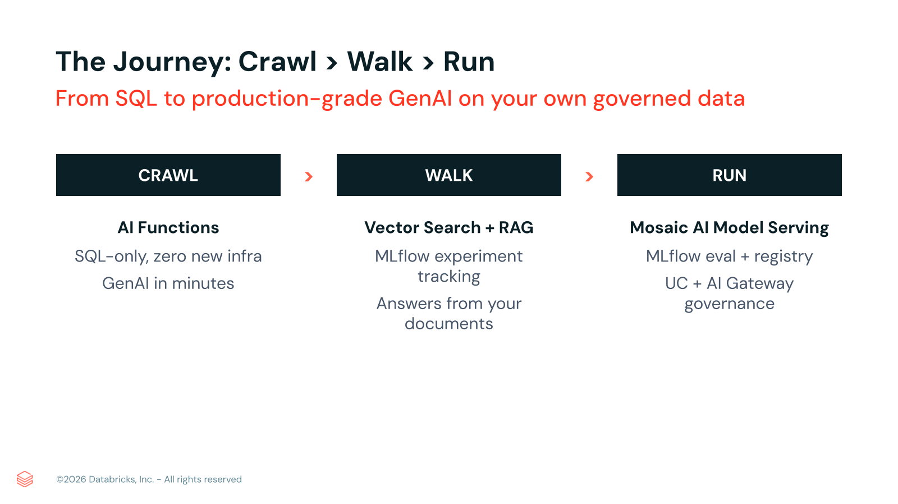

# 2026.09.14 - Axos Bank - Session 5 - Databricks + Production GenAI Part 1

> **Slides:** 10 | **Source:** https://docs.google.com/presentation/d/1m2spc85Z36MvMNMcYVS1aVKvY6vfibPcnXEBxYTyUc4/edit | **Images:** 1

---

## Slide 1: Session 5: Databricks + Production GenAI Part 1

Kevin Collin
Enterprise Account Executive
Duffy Walsh
Solutions Architect

> **Notes:** All corporations, and certainly FIs who have traditionally been early adopters and security scrutinizers, face a growing technical sprawl.
>
> How many different AI tools or models are in use across a single institution right now?
>
> I think for many institutions the answer is usually "we don't know", and what the leaders of these institutions seek is insight and control.
>
> The reality we see at most banks is that AI adoption is happening in pockets: different teams, different vendors (OpenAI here, a Llama model there, a SaaS copilot somewhere else), each with its own login, its own bill, its own risk profile.
>
> No single view, no single control.
>
> This is session 4, for Axos Bank, in an enablement series around Databricks, and once again we focus on the fictional regulated bank, TodayBank. As regards governing enterprise AI, TodayBank is facing three problems at once:
> cost they can't see or cap;
> risk they struggle to prove they're managing (PII leaving the building, unsafe outputs);
> and speed they lose because every project rebuilds the same plumbing.
>
> What I will demonstrate today is that the Databricks' Unity AI Gateway is the one governed front door, not endpoint, for all of TodayBank's Enterprise AI.

---

## Slide 2: Forward-looking Statement

This presentation has been prepared for informational purposes only. The information set forth herein does not purport to be complete or contain all relevant information. Statements contained herein are made as of the date of this presentation unless stated otherwise.
This presentation and the accompanying oral commentary may contain forward-looking statements. In some cases, forward-looking statements can be identified by terms such as "may", "will", "should", "expects", "plans", "anticipates", "could", "intends", "projects", "believes", "estimates", "predicts", or "continue", or the negative of these words or other similar terms or expressions that concern Databricks' expectations, strategy, plans, or intentions.
Forward-looking statements are based on information available at the time those statements are made and are inherently subject to risks and uncertainties that could cause actual results to differ materially from those expressed in or suggested by the forward-looking statements.
Forward-looking statements should not be read as a guarantee of future performance or outcomes. Except as required by law, Databricks does not undertake any obligation to publicly update or revise any forward-looking statement, whether as a result of new information, future developments or otherwise.

> **Notes:** Standard forward-looking / safe-harbor statement.
>
> Today's presentation mixes GA, Public Preview, and Beta capabilities.
>
> I'll flag the maturity of each as we go, and there's a status summary near the end.

---

## Slide 3: Databricks + Production Worthy GenAI

Built Upon the Foundations presented in the Previous Sessions
Session 1: Lakehouse + Medallion Architecture
Session 2: Unity Catalog + Governance
Session 3: Agentic Capabilities
Session 4: Unity Gateway

Where we are going:
AI Functions and GenAI
Vector Search
RAG pipelines
Governed model serving

> **Notes:** For all of our sessions we have been telling a story about an open simplified architecture, the Data Lake House, and how having a single copy of data lays the groundwork for universal governance, and that governance enables Databricks Agentic Capabilities.
>
> The story of control, choice, and context extends with Unity Gateway, and today we are going to double click into AI, and talk about how these foundational elements will allow Axos to "crawl, walk, then run" with Generative AI in production with continued governance, insight, and delivered value.
>
> You already have the hard part - a governed Lakehouse on Unity Catalog. What you have not turned on yet is GenAI. Today we go from zero to a production-grade, governed assistant on your own data, in three steps: crawl, walk, run. It is mostly live, not slides.
>
> What I will demonstrate today is:
> That with Databricks you can build on what you already have. GenAI runs on your existing governed Lakehouse data with no data movement, and no separate GenAI stack to secure.
>
> You can start small, and scale with confidence. Each stage delivers value on its own; and you are never forced into a big-bang project.
> From the start your GenAI approach is governed and examinable by design. Access control, PII masking, guardrails, lineage, and audit are inherited from the platform, the control story a bank and its examiners expect.
> Lending-relevant from day one. The anchor use case (underwriting document assistant) maps directly to real Axos workflows.

---

## Slide 4: The Journey: Crawl > Walk > Run

From SQL to production-grade GenAI on your own governed data

CRAWL
AI Functions
SQL-only, zero new infra
GenAI in minutes

>

WALK
Vector Search + RAG
MLflow experiment tracking
Answers from your documents

>

RUN
Mosaic AI Model Serving
MLflow eval + registry
UC + AI Gateway governance

> **Notes:** So here's what we will look at today. By GenAI (Generative AI) we mean AI models that generate new content, text, summaries, classifications, structured output, from natural-language input. And in the demo we will show how this is applied directly in SQL via AI Functions (ai_classify, ai_extract, ai_summarize, ai_query) over governed banking tables, routing support tickets and pulling structured risk fields from free-text underwriter notes, with zero new infrastructure.
>
> As a common definition, vector search is a managed index that stores embeddings of your text and retrieves the most semantically relevant passages for a query. Which I will demonstrate as Databricks-managed embeddings (gte-large-en) index TodayBank's chunked underwriting and compliance policy documents, so an underwriter's question retrieves the exact relevant policy sections.
>
> RAG (Retrieval-Augmented Generation) is the pattern that grounds an LLM's answer in retrieved source content, so responses cite real documents instead of hallucinating, so in the "Walk" phase of our demo we will show how every answer to an underwriting or Reg B question is grounded in TodayBank's own policies and returns a citation to the source document and section.
>
> Databricks acquired Mosaic (Mosaic AI Model Serving) in 2023, integrating their managed, autoscaling infrastructure that deploys a model or agent behind a live, observable REST endpoint. And this will be demonstrated as it serves the packaged loan/underwriting document assistant on a managed endpoint (axos-loan-doc-assistant), where every call is traced, the RAG prototype promoted to a production-grade, governed service.

---

## Slide 5: 00 - Demo

Demo
Loan Underwriting Document Assistant

> **Notes:** This demo uses our fictional TodayBank and a use case of the loan lending/underwriting story across the Crawl - Walk - Run arc, being a Loan Underwriting Document Assistant.

---

## Slide 6: 01 - CRAWL

CRAWL
GenAI with zero infra, just SQL

> **Notes:** For Crawl we will use (AI Functions) for operational lending + servicing value in SQL. To wit ai_classify routes support tickets, ai_extract pulls structured fields (risk flags, recommendation, exceptions) out of free-text underwriter notes, ai_summarize gives one-line summaries.

---

## Slide 7: 02 - WALK

WALK
Ground answers in your own documents

> **Notes:** Walk (Vector Search + RAG) you ground answers in the bank's underwriting & compliance policy docs (LTV/DTI matrices, Reg B/ECOA, exception-escalation rules).
>
> An evolution from several powerful functions.

---

## Slide 8: 03 - RUN

RUN
Production-grade, governed, served

> **Notes:** Run (Mosaic AI Model Serving): the production loan-doc assistant as a model: registered, evaluated, served, traced.
> 1. Operationalization / access -- it becomes an API any internal system can call, it's no longer a notebook
> 2. Governance & examinability -- versioned, permissioned, rate-limited, every call logged -- finer granularity and speed in the regulator-ready story
> 3. Scalability & reliability -- managed serving instead of a session.
> 4. Trust gate -- evaluated with metrics before it ships.

---

## Slide 9: Where Axos Bank Gets Value

Loan + underwriting assistant: governed, auditable, cost-capped
Compliance Q+A grounded in your own policy documents
AI Functions in existing SQL and ETL pipelines
Every use case inherits UC governance and AI Gateway controls on day one

Production-grade means governed, auditable, and yours.

> **Notes:** TODAYBANK USE CASES (~6 min). Concrete, business-framed scenarios for a digital-first bank:
> - Customer-service copilot -- governed, PII-masked, cost-capped; safe to scale to the contact center.
> - Fraud & complaints triage -- AI summarization over sensitive cases, fully audited.
> - Marketing / content generation -- high volume, so rate limits keep spend predictable.
> - Developer & analyst productivity -- many teams, one governed gateway, one bill.
> Tie each back to the four angles -- control, risk, speed, flexibility. Every new TodayBank use case inherits the controls automatically.

---

## Slide 10: Q & A

> **Notes:** CLOSE + NEXT STEPS.
> Next step for TodayBank: a scoped pilot.
> "The winners in banking AI won't adopt the most -- they'll adopt under control. This is that control."
> Then open for discussion / Q&A.
